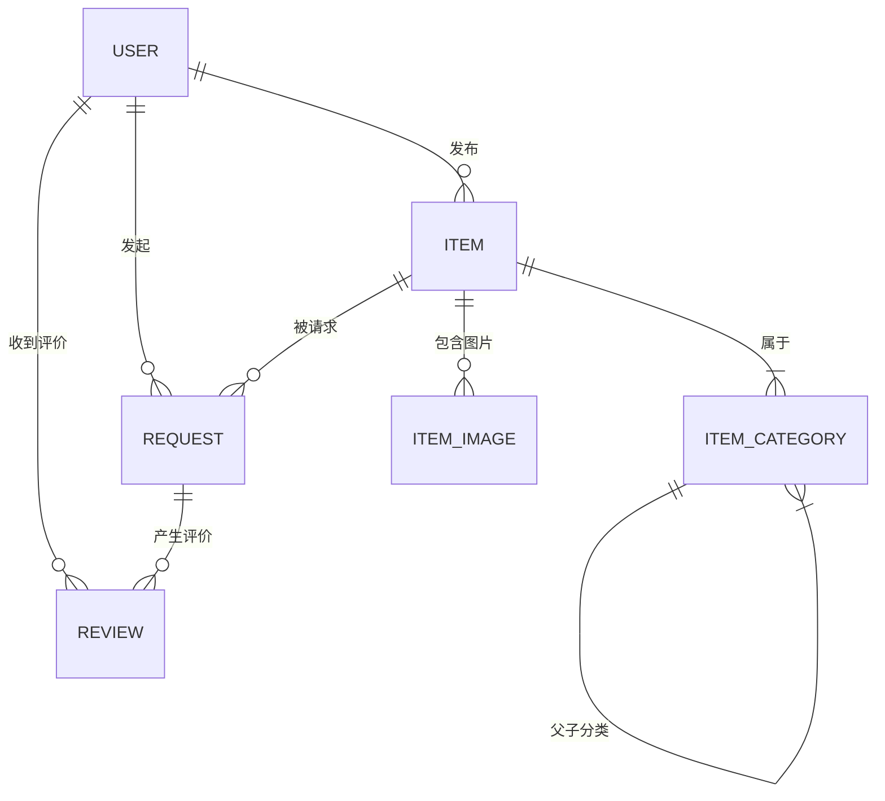

以下是为**社区二手物品交易平台**设计的详细项目文档，涵盖核心业务、功能模块、数据库设计、服务端架构、API接口等关键内容。文档力求清晰规范，可直接用于课程设计报告。

---

# 社区二手物品交易平台项目文档  
**版本**：1.0  
**日期**：2025年5月31日  

---

## 一、项目概述
### 1.1 核心业务  
构建一个服务于小区或校园的二手物品交易平台，支持用户发布闲置物品、搜索附近物品、发起交换/捐赠请求、在线沟通、交易状态管理等功能，促进资源循环利用。

### 1.2 核心功能模块  
| **模块**       | **功能说明**                                                 |
| -------------- | ------------------------------------------------------------ |
| **用户管理**   | 用户注册/登录、个人信息管理、信誉评分（基于交易评价）        |
| **物品管理**   | 发布物品（标题、描述、图片、分类、状态）、修改/下架物品、标记交易状态 |
| **分类管理**   | 树状多级分类（如：家电→厨房电器→电饭煲）                     |
| **搜索与发现** | 按关键词/分类/位置/状态筛选物品、查看“附近物品”              |
| **交易流程**   | 发起交换/捐赠请求、接受/拒绝请求、状态变更（待交易→已预定→已完成） |
| **消息通知**   | 站内信（请求通知、状态变更通知）、系统公告                   |
| **评价系统**   | 买卖双方互评（评分+文字评价）                                |
| **数据统计**   | 热门分类分析、用户活跃度统计、物品成交率                     |

---

## 二、数据库设计（MySQL 8.0+）
### 2.1 ER图（简化版）


### 2.2 数据表结构

下面是生成数据库的sql代码：
```mysql
-- 创建数据库
CREATE DATABASE IF NOT EXISTS `secondhand_trading_platform` DEFAULT CHARACTER SET utf8mb4 COLLATE utf8mb4_unicode_ci;
USE `secondhand_trading_platform`;

-- 1. 用户表 (user)
CREATE TABLE `user` (
    `user_id` INT AUTO_INCREMENT PRIMARY KEY COMMENT '用户ID',
    `username` VARCHAR(20) NOT NULL UNIQUE COMMENT '用户名，唯一',
    `password_hash` VARCHAR(128) NOT NULL COMMENT '密码哈希值',
    `email` VARCHAR(50) NOT NULL UNIQUE COMMENT '邮箱，唯一',
    `phone` VARCHAR(15) COMMENT '手机号，可选',
    `address` VARCHAR(200) COMMENT '街道级地址',
    `latitude` DECIMAL(9,6) COMMENT '用户注册地址的纬度',
    `longitude` DECIMAL(9,6) COMMENT '用户注册地址的经度',
    `reputation_score` FLOAT DEFAULT 5.0 COMMENT '信誉评分，范围1.0-5.0',
    `is_admin` BOOLEAN DEFAULT FALSE COMMENT '是否为管理员',
    `created_at` DATETIME DEFAULT CURRENT_TIMESTAMP COMMENT '用户注册时间',
    INDEX `idx_username` (`username`),
    INDEX `idx_email` (`email`),
    INDEX `idx_created_at` (`created_at`)
) ENGINE=InnoDB DEFAULT CHARSET=utf8mb4 COLLATE=utf8mb4_unicode_ci COMMENT='用户表';

-- 2. 物品分类表 (item_category)
CREATE TABLE `item_category` (
    `category_id` INT AUTO_INCREMENT PRIMARY KEY COMMENT '分类ID',
    `name` VARCHAR(50) NOT NULL COMMENT '分类名称',
    `parent_id` INT COMMENT '父分类ID',
    FOREIGN KEY (`parent_id`) REFERENCES `item_category`(`category_id`) ON DELETE SET NULL,
    INDEX `idx_parent_id` (`parent_id`),
    INDEX `idx_name` (`name`)
) ENGINE=InnoDB DEFAULT CHARSET=utf8mb4 COLLATE=utf8mb4_unicode_ci COMMENT='物品分类表';

-- 3. 物品表 (item)
CREATE TABLE `item` (
    `item_id` INT AUTO_INCREMENT PRIMARY KEY COMMENT '物品ID',
    `user_id` INT NOT NULL COMMENT '发布者ID',
    `title` VARCHAR(100) NOT NULL COMMENT '物品标题',
    `description` TEXT NOT NULL COMMENT '物品详细描述',
    `category_id` INT NOT NULL COMMENT '分类ID',
    `status` ENUM('available', 'reserved', 'completed', 'cancelled') NOT NULL DEFAULT 'available' COMMENT '物品状态',
    `condition` ENUM('new', 'like_new', 'used', 'worn') NOT NULL COMMENT '新旧程度',
    `latitude` DECIMAL(9,6) COMMENT '物品发布地点的纬度',
    `longitude` DECIMAL(9,6) COMMENT '物品发布地点的经度',
    `created_at` DATETIME DEFAULT CURRENT_TIMESTAMP COMMENT '物品发布时间',
    `updated_at` DATETIME DEFAULT CURRENT_TIMESTAMP ON UPDATE CURRENT_TIMESTAMP COMMENT '物品信息最后更新时间',
    FOREIGN KEY (`user_id`) REFERENCES `user`(`user_id`) ON DELETE CASCADE,
    FOREIGN KEY (`category_id`) REFERENCES `item_category`(`category_id`) ON DELETE RESTRICT,
    INDEX `idx_user_id` (`user_id`),
    INDEX `idx_category_id` (`category_id`),
    INDEX `idx_status` (`status`),
    INDEX `idx_created_at` (`created_at`),
    INDEX `idx_title` (`title`)
) ENGINE=InnoDB DEFAULT CHARSET=utf8mb4 COLLATE=utf8mb4_unicode_ci COMMENT='物品表';

-- 4. 物品图片表 (item_image)
CREATE TABLE `item_image` (
    `image_id` INT AUTO_INCREMENT PRIMARY KEY COMMENT '图片ID',
    `item_id` INT NOT NULL COMMENT '所属物品ID',
    `image_url` VARCHAR(255) NOT NULL COMMENT '图片存储路径',
    `is_primary` BOOLEAN DEFAULT FALSE COMMENT '是否为主图',
    `created_at` DATETIME DEFAULT CURRENT_TIMESTAMP COMMENT '图片上传时间',
    FOREIGN KEY (`item_id`) REFERENCES `item`(`item_id`) ON DELETE CASCADE,
    INDEX `idx_item_id` (`item_id`),
    INDEX `idx_is_primary` (`is_primary`)
) ENGINE=InnoDB DEFAULT CHARSET=utf8mb4 COLLATE=utf8mb4_unicode_ci COMMENT='物品图片表';

-- 5. 请求表 (request)
CREATE TABLE `request` (
    `request_id` INT AUTO_INCREMENT PRIMARY KEY COMMENT '请求ID',
    `item_id` INT NOT NULL COMMENT '目标物品ID',
    `requester_id` INT NOT NULL COMMENT '请求者ID',
    `message` VARCHAR(200) COMMENT '附言',
    `status` ENUM('pending', 'accepted', 'rejected', 'cancelled') NOT NULL DEFAULT 'pending' COMMENT '请求状态',
    `created_at` DATETIME DEFAULT CURRENT_TIMESTAMP COMMENT '请求时间',
    `updated_at` DATETIME DEFAULT CURRENT_TIMESTAMP ON UPDATE CURRENT_TIMESTAMP COMMENT '请求状态最后更新时间',
    FOREIGN KEY (`item_id`) REFERENCES `item`(`item_id`) ON DELETE CASCADE,
    FOREIGN KEY (`requester_id`) REFERENCES `user`(`user_id`) ON DELETE CASCADE,
    INDEX `idx_item_id` (`item_id`),
    INDEX `idx_requester_id` (`requester_id`),
    INDEX `idx_status` (`status`),
    INDEX `idx_created_at` (`created_at`)
) ENGINE=InnoDB DEFAULT CHARSET=utf8mb4 COLLATE=utf8mb4_unicode_ci COMMENT='请求表';

-- 6. 评价表 (review)
CREATE TABLE `review` (
    `review_id` INT AUTO_INCREMENT PRIMARY KEY COMMENT '评价ID',
    `request_id` INT NOT NULL UNIQUE COMMENT '关联的请求ID',
    `reviewer_id` INT NOT NULL COMMENT '评价人ID',
    `reviewee_id` INT NOT NULL COMMENT '被评价人ID',
    `rating` SMALLINT NOT NULL COMMENT '评分（1-5分）',
    `comment` VARCHAR(200) COMMENT '文字评价',
    `created_at` DATETIME DEFAULT CURRENT_TIMESTAMP COMMENT '评价时间',
    FOREIGN KEY (`request_id`) REFERENCES `request`(`request_id`) ON DELETE CASCADE,
    FOREIGN KEY (`reviewer_id`) REFERENCES `user`(`user_id`) ON DELETE CASCADE,
    FOREIGN KEY (`reviewee_id`) REFERENCES `user`(`user_id`) ON DELETE CASCADE,
    INDEX `idx_request_id` (`request_id`),
    INDEX `idx_reviewer_id` (`reviewer_id`),
    INDEX `idx_reviewee_id` (`reviewee_id`),
    INDEX `idx_rating` (`rating`),
    INDEX `idx_created_at` (`created_at`),
    CONSTRAINT `chk_rating` CHECK (`rating` >= 1 AND `rating` <= 5)
) ENGINE=InnoDB DEFAULT CHARSET=utf8mb4 COLLATE=utf8mb4_unicode_ci COMMENT='评价表';

-- 7. 消息表 (message)
CREATE TABLE `message` (
    `message_id` INT AUTO_INCREMENT PRIMARY KEY COMMENT '消息ID',
    `recipient_id` INT NOT NULL COMMENT '消息接收者ID',
    `sender_id` INT COMMENT '消息发送者ID',
    `type` ENUM('request_notification', 'status_update', 'system_announcement', 'chat_message') NOT NULL COMMENT '消息类型',
    `related_id` INT COMMENT '关联的业务ID',
    `content` TEXT NOT NULL COMMENT '消息内容',
    `is_read` BOOLEAN DEFAULT FALSE COMMENT '是否已读',
    `created_at` DATETIME DEFAULT CURRENT_TIMESTAMP COMMENT '消息创建时间',
    FOREIGN KEY (`recipient_id`) REFERENCES `user`(`user_id`) ON DELETE CASCADE,
    FOREIGN KEY (`sender_id`) REFERENCES `user`(`user_id`) ON DELETE SET NULL,
    INDEX `idx_recipient_id` (`recipient_id`),
    INDEX `idx_sender_id` (`sender_id`),
    INDEX `idx_type` (`type`),
    INDEX `idx_is_read` (`is_read`),
    INDEX `idx_created_at` (`created_at`)
) ENGINE=InnoDB DEFAULT CHARSET=utf8mb4 COLLATE=utf8mb4_unicode_ci COMMENT='消息表';

-- 插入默认管理员用户
INSERT INTO `user` (`username`, `password_hash`, `email`, `is_admin`) VALUES
('admin', 'pbkdf2:sha256:600000$salt$hash', 'admin@example.com', TRUE);

-- 插入默认分类数据
INSERT INTO `item_category` (`name`, `parent_id`) VALUES
('电子产品', NULL),
('图书文具', NULL),
('生活用品', NULL),
('服装配饰', NULL),
('运动健身', NULL),
('其他', NULL);

-- 插入子分类
INSERT INTO `item_category` (`name`, `parent_id`) VALUES
('手机数码', 1),
('电脑配件', 1),
('教材教辅', 2),
('文具用品', 2),
('日用百货', 3),
('家居用品', 3),
('男装', 4),
('女装', 4),
('运动器材', 5),
('健身用品', 5);


-- 插入示例数据到 secondhand_trading_platform 数据库
USE secondhand_trading_platform;

-- 1. 插入用户数据（除了已有的admin用户）
INSERT INTO `user` (`username`, `password_hash`, `email`, `phone`, `address`, `latitude`, `longitude`, `reputation_score`, `is_admin`) VALUES
('张三', 'pbkdf2:sha256:600000$salt1$hash1', 'zhangsan@student.edu.cn', '13800138001', '北京市海淀区中关村大街1号', 39.984702, 116.318417, 4.8, FALSE),
('李四', 'pbkdf2:sha256:600000$salt2$hash2', 'lisi@student.edu.cn', '13800138002', '北京市海淀区知春路2号', 39.977565, 116.326789, 4.5, FALSE),
('王五', 'pbkdf2:sha256:600000$salt3$hash3', 'wangwu@student.edu.cn', '13800138003', '北京市海淀区学院路3号', 39.991234, 116.355678, 4.9, FALSE),
('赵六', 'pbkdf2:sha256:600000$salt4$hash4', 'zhaoliu@student.edu.cn', '13800138004', '北京市海淀区清华园4号', 40.003456, 116.331234, 4.2, FALSE),
('钱七', 'pbkdf2:sha256:600000$salt5$hash5', 'qianqi@student.edu.cn', '13800138005', '北京市海淀区北大街5号', 39.996789, 116.308901, 4.7, FALSE),
('孙八', 'pbkdf2:sha256:600000$salt6$hash6', 'sunba@student.edu.cn', '13800138006', '北京市海淀区五道口6号', 39.989012, 116.342345, 4.6, FALSE);

-- 2. 插入物品数据
INSERT INTO `item` (`user_id`, `title`, `description`, `category_id`, `status`, `condition`, `latitude`, `longitude`) VALUES
(2, 'iPhone 13 Pro 256GB 深空灰', '九成新iPhone 13 Pro，256GB存储，深空灰色，无磕碰，功能正常，配原装充电器和数据线，还有11个月保修', 7, 'available', 'like_new', 39.984702, 116.318417),
(3, 'MacBook Air M1 2021款', '2021款MacBook Air，M1芯片，8GB内存，256GB存储，几乎全新，仅使用3个月，配原装充电器', 8, 'available', 'like_new', 39.977565, 116.326789),
(4, '高等数学教材上下册', '同济大学版高等数学上下册，第七版，有少量笔记，无缺页撕页，适合理工科学生', 9, 'available', 'used', 39.991234, 116.355678),
(5, '数据结构与算法分析', 'C++版数据结构与算法分析，经典教材，适合计算机专业学生，书况良好', 9, 'available', 'used', 40.003456, 116.331234),
(6, '小米护眼台灯', '小米护眼台灯Pro，可调节亮度和色温，适合学习使用，九成新，功能完好', 12, 'available', 'like_new', 39.996789, 116.308901),
(2, 'Nike Air Max 270 运动鞋', 'Nike Air Max 270，42码，黑白配色，轻微使用痕迹，鞋底磨损不严重', 4, 'completed', 'used', 39.984702, 116.318417),
(3, 'ThinkPad E14 笔记本', 'ThinkPad E14，i5-1135G7处理器，8GB内存，512GB固态硬盘，商务办公首选', 8, 'reserved', 'used', 39.977565, 116.326789),
(4, '英语四级真题集', '星火英语四级真题集，2020-2023年真题，含详细解析，备考必备', 9, 'available', 'like_new', 39.991234, 116.355678),
(5, '无线蓝牙耳机', 'AirPods Pro 2代，主动降噪，空间音频，配充电盒，使用半年', 7, 'available', 'used', 40.003456, 116.331234),
(6, '健身哑铃套装', '可调节哑铃套装，5-25kg，适合家庭健身，几乎全新', 16, 'available', 'like_new', 39.996789, 116.308901);

-- 3. 插入物品图片数据
INSERT INTO `item_image` (`item_id`, `image_url`, `is_primary`) VALUES
(1, '/static/uploads/iphone13_1.jpg', TRUE),
(1, '/static/uploads/iphone13_2.jpg', FALSE),
(1, '/static/uploads/iphone13_3.jpg', FALSE),
(2, '/static/uploads/macbook_1.jpg', TRUE),
(2, '/static/uploads/macbook_2.jpg', FALSE),
(3, '/static/uploads/math_book_1.jpg', TRUE),
(4, '/static/uploads/algorithm_book_1.jpg', TRUE),
(5, '/static/uploads/xiaomi_lamp_1.jpg', TRUE),
(5, '/static/uploads/xiaomi_lamp_2.jpg', FALSE),
(6, '/static/uploads/nike_shoes_1.jpg', TRUE),
(7, '/static/uploads/thinkpad_1.jpg', TRUE),
(7, '/static/uploads/thinkpad_2.jpg', FALSE),
(8, '/static/uploads/english_book_1.jpg', TRUE),
(9, '/static/uploads/airpods_1.jpg', TRUE),
(10, '/static/uploads/dumbbell_1.jpg', TRUE);

-- 4. 插入交易请求数据
INSERT INTO `request` (`item_id`, `requester_id`, `message`, `status`) VALUES
(1, 3, '您好，我对这个iPhone很感兴趣，价格还能商量吗？可以面交看货吗？', 'pending'),
(1, 4, '手机还在吗？我想要，什么时候可以交易？', 'pending'),
(2, 5, 'MacBook还有保修吗？配件齐全吗？我很需要一台笔记本', 'pending'),
(3, 6, '数学书还在吗？我需要上下册，书的状态怎么样？', 'accepted'),
(5, 4, '台灯功能正常吗？有说明书和保修卡吗？', 'pending'),
(6, 7, '鞋子我很喜欢，什么时候可以交易？', 'accepted'),
(7, 6, 'ThinkPad配置怎么样？适合编程开发吗？', 'accepted'),
(8, 2, '英语真题还有吗？我马上要考试了，急需', 'accepted'),
(9, 4, 'AirPods还有保修吗？音质怎么样？', 'pending'),
(10, 3, '哑铃套装还在吗？重量可以调节到多少？', 'pending');

-- 5. 插入评价数据
INSERT INTO `review` (`request_id`, `reviewer_id`, `reviewee_id`, `rating`, `comment`) VALUES
(6, 7, 2, 5, '鞋子质量很好，卖家人也很nice，交易很愉快！推荐！'),
(4, 6, 4, 4, '书的内容完整，就是有点旧，但价格合理，卖家很诚信'),
(8, 2, 4, 5, '真题很新，解析详细，对备考很有帮助，非常满意');

-- 6. 插入消息数据
INSERT INTO `message` (`recipient_id`, `sender_id`, `type`, `related_id`, `content`, `is_read`) VALUES
(2, 3, 'request_notification', 1, '用户张三对您的iPhone 13 Pro发起了交易请求', TRUE),
(2, 4, 'request_notification', 2, '用户李四对您的iPhone 13 Pro发起了交易请求', TRUE),
(3, 5, 'request_notification', 3, '用户王五对您的MacBook Air发起了交易请求', TRUE),
(4, 6, 'request_notification', 4, '用户赵六对您的高等数学教材发起了交易请求', TRUE),
(6, 4, 'request_notification', 5, '用户李四对您的小米台灯发起了交易请求', FALSE),
(2, 7, 'request_notification', 6, '用户钱七对您的Nike运动鞋发起了交易请求', TRUE),
(3, 6, 'request_notification', 7, '用户赵六对您的ThinkPad笔记本发起了交易请求', TRUE),
(4, 2, 'request_notification', 8, '用户张三对您的英语四级真题发起了交易请求', TRUE),
(5, 4, 'request_notification', 9, '用户李四对您的AirPods Pro发起了交易请求', FALSE),
(6, 3, 'request_notification', 10, '用户张三对您的哑铃套装发起了交易请求', FALSE),
(3, 2, 'status_update', 1, '您对iPhone 13 Pro的交易请求状态已更新', TRUE),
(6, 4, 'status_update', 4, '您对高等数学教材的交易请求已被接受', TRUE),
(7, 2, 'status_update', 6, '您对Nike运动鞋的交易请求已被接受', TRUE),
(2, 4, 'status_update', 8, '您对英语四级真题的交易请求已被接受', TRUE),
(1, NULL, 'system_announcement', NULL, '欢迎使用二手物品交易平台！请遵守交易规则，诚信交易。', FALSE),
(2, NULL, 'system_announcement', NULL, '平台将于本周末进行系统维护，维护期间可能影响部分功能使用。', FALSE),
(3, 2, 'chat_message', 1, '您好，iPhone的电池健康度怎么样？', TRUE),
(2, 3, 'chat_message', 1, '电池健康度还有92%，使用正常，可以放心', FALSE),
(5, 3, 'chat_message', 3, 'MacBook的屏幕有没有亮点或者划痕？', TRUE),
(3, 5, 'chat_message', 3, '屏幕完好无损，没有亮点，我一直贴着膜使用', FALSE);

-- 7. 更新用户信誉评分（基于收到的评价）
UPDATE `user` SET `reputation_score` = (
    SELECT AVG(`rating`) 
    FROM `review` 
    WHERE `reviewee_id` = `user`.`user_id`
) WHERE `user_id` IN (
    SELECT DISTINCT `reviewee_id` FROM `review`
);

-- 8. 验证数据插入结果
SELECT '用户数据' as table_name, COUNT(*) as count FROM `user`
UNION ALL
SELECT '物品分类', COUNT(*) FROM `item_category`
UNION ALL
SELECT '物品数据', COUNT(*) FROM `item`
UNION ALL
SELECT '物品图片', COUNT(*) FROM `item_image`
UNION ALL
SELECT '交易请求', COUNT(*) FROM `request`
UNION ALL
SELECT '评价数据', COUNT(*) FROM `review`
UNION ALL
SELECT '消息数据', COUNT(*) FROM `message`;

-- 9. 查看各状态的物品分布
SELECT `status`, COUNT(*) as count 
FROM `item` 
GROUP BY `status`;

-- 10. 查看各分类的物品数量
SELECT c.`name` as category_name, COUNT(i.`item_id`) as item_count
FROM `item_category` c
LEFT JOIN `item` i ON c.`category_id` = i.`category_id`
GROUP BY c.`category_id`, c.`name`
ORDER BY item_count DESC;

```


