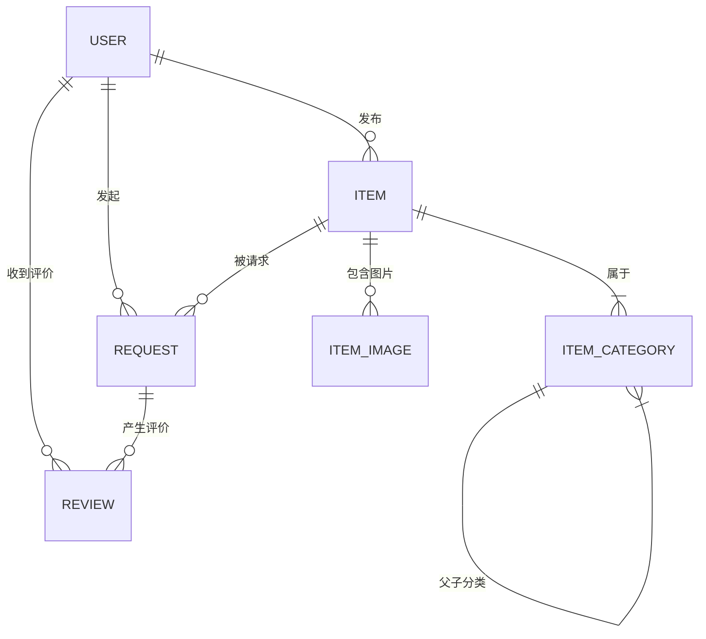

以下是为**社区二手物品交易平台**设计的详细项目文档，涵盖核心业务、功能模块、数据库设计、服务端架构、API接口等关键内容。文档力求清晰规范，可直接用于课程设计报告。

---

# 社区二手物品交易平台项目文档  
**版本**：1.0  
**日期**：2025年5月31日  

---

## 一、项目概述
### 1.1 核心业务  
构建一个服务于小区或校园的二手物品交易平台，支持用户发布闲置物品、搜索附近物品、发起交换/捐赠请求、在线沟通、交易状态管理等功能，促进资源循环利用。

### 1.2 核心功能模块  
| **模块**       | **功能说明**                                                 |
| -------------- | ------------------------------------------------------------ |
| **用户管理**   | 用户注册/登录、个人信息管理、信誉评分（基于交易评价）        |
| **物品管理**   | 发布物品（标题、描述、图片、分类、状态）、修改/下架物品、标记交易状态 |
| **分类管理**   | 树状多级分类（如：家电→厨房电器→电饭煲）                     |
| **搜索与发现** | 按关键词/分类/位置/状态筛选物品、查看“附近物品”              |
| **交易流程**   | 发起交换/捐赠请求、接受/拒绝请求、状态变更（待交易→已预定→已完成） |
| **消息通知**   | 站内信（请求通知、状态变更通知）、系统公告                   |
| **评价系统**   | 买卖双方互评（评分+文字评价）                                |
| **数据统计**   | 热门分类分析、用户活跃度统计、物品成交率                     |

---

## 二、数据库设计（MySQL 8.0+）
### 2.1 ER图（简化版）


### 2.2 数据表结构

下面是生成数据库的sql代码：
```mysql
-- 创建数据库（如果不存在）
CREATE DATABASE IF NOT EXISTS `secondhand_trading_platform` DEFAULT CHARACTER SET utf8mb4 COLLATE utf8mb4_unicode_ci;
USE `secondhand_trading_platform`;

-- 1. 用户表 `user`
-- 存储平台用户的基本信息、认证信息和信誉评分
CREATE TABLE `user` (
    `user_id` INT AUTO_INCREMENT PRIMARY KEY COMMENT '用户ID',
    `username` VARCHAR(20) UNIQUE NOT NULL COMMENT '用户名，唯一',
    `password_hash` VARCHAR(128) NOT NULL COMMENT '密码哈希值，用于安全存储密码 (长度调整为128以适应强哈希)',
    `email` VARCHAR(50) UNIQUE NOT NULL COMMENT '邮箱，唯一，用于登录和通知',
    `phone` VARCHAR(15) COMMENT '手机号，可选',
    `address` VARCHAR(200) NOT NULL COMMENT '街道级地址，用于附近搜索和地理位置服务',
    `latitude` DECIMAL(9,6) COMMENT '用户注册地址的纬度',
    `longitude` DECIMAL(9,6) COMMENT '用户注册地址的经度',
    `reputation_score` FLOAT DEFAULT 5.0 COMMENT '信誉评分，范围1.0-5.0, CHECK (`reputation_score` >= 1.0 AND `reputation_score` <= 5.0) -- CHECK约束在某些MySQL版本中可能不直接支持，通常通过应用逻辑保证',
    `is_admin` BOOLEAN DEFAULT FALSE COMMENT '是否为管理员',
    `created_at` TIMESTAMP DEFAULT CURRENT_TIMESTAMP COMMENT '用户注册时间'
) ENGINE=InnoDB DEFAULT CHARSET=utf8mb4 COLLATE=utf8mb4_unicode_ci COMMENT='用户表';

-- 2. 物品分类表 `item_category`
-- 存储物品的分类信息，支持树形结构（父子分类）
CREATE TABLE `item_category` (
    `category_id` INT AUTO_INCREMENT PRIMARY KEY COMMENT '分类ID',
    `name` VARCHAR(50) NOT NULL COMMENT '分类名称，如“家电”、“书籍”',
    `parent_id` INT DEFAULT NULL COMMENT '父分类ID，根分类为NULL',
    CONSTRAINT `fk_parent_category` FOREIGN KEY (`parent_id`) REFERENCES `item_category` (`category_id`) ON DELETE SET NULL ON UPDATE CASCADE -- 改为SET NULL防止父分类删除时级联删除子分类
) ENGINE=InnoDB DEFAULT CHARSET=utf8mb4 COLLATE=utf8mb4_unicode_ci COMMENT='物品分类表';

-- 3. 物品表 `item`
-- 存储用户发布的二手物品详细信息
CREATE TABLE `item` (
    `item_id` INT AUTO_INCREMENT PRIMARY KEY COMMENT '物品ID',
    `user_id` INT NOT NULL COMMENT '发布者ID，关联用户表',
    `title` VARCHAR(100) NOT NULL COMMENT '物品标题',
    `description` TEXT NOT NULL COMMENT '物品详细描述',
    `category_id` INT NOT NULL COMMENT '分类ID，关联物品分类表',
    `status` ENUM('available', 'reserved', 'completed', 'cancelled') NOT NULL DEFAULT 'available' COMMENT '物品状态: available(可交易)/reserved(已预定)/completed(已完成)/cancelled(已取消)',
    `condition` ENUM('new', 'like_new', 'used', 'worn') NOT NULL COMMENT '新旧程度: new(全新)/like_new(九成新)/used(旧)/worn(磨损严重)',
    `latitude` DECIMAL(9,6) COMMENT '物品发布地点的纬度',
    `longitude` DECIMAL(9,6) COMMENT '物品发布地点的经度',
    `created_at` TIMESTAMP DEFAULT CURRENT_TIMESTAMP COMMENT '物品发布时间',
    `updated_at` TIMESTAMP DEFAULT CURRENT_TIMESTAMP ON UPDATE CURRENT_TIMESTAMP COMMENT '物品信息最后更新时间',
    CONSTRAINT `fk_item_user` FOREIGN KEY (`user_id`) REFERENCES `user` (`user_id`) ON DELETE CASCADE ON UPDATE CASCADE,
    CONSTRAINT `fk_item_category` FOREIGN KEY (`category_id`) REFERENCES `item_category` (`category_id`) ON DELETE RESTRICT ON UPDATE CASCADE
) ENGINE=InnoDB DEFAULT CHARSET=utf8mb4 COLLATE=utf8mb4_unicode_ci COMMENT='物品表';

-- 4. 物品图片表 `item_image`
-- 存储物品关联的图片URL，支持多张图片
CREATE TABLE `item_image` (
    `image_id` INT AUTO_INCREMENT PRIMARY KEY COMMENT '图片ID',
    `item_id` INT NOT NULL COMMENT '所属物品ID，关联物品表',
    `image_url` VARCHAR(255) NOT NULL COMMENT '图片存储路径（本地相对路径或OSS URL，长度调整为255）',
    `is_primary` BOOLEAN DEFAULT FALSE COMMENT '是否为主图，一个物品通常只有一张主图',
    `created_at` TIMESTAMP DEFAULT CURRENT_TIMESTAMP COMMENT '图片上传时间',
    CONSTRAINT `fk_image_item` FOREIGN KEY (`item_id`) REFERENCES `item` (`item_id`) ON DELETE CASCADE ON UPDATE CASCADE
) ENGINE=InnoDB DEFAULT CHARSET=utf8mb4 COLLATE=utf8mb4_unicode_ci COMMENT='物品图片表';

-- 5. 交换请求表 `request`
-- 存储用户发起的物品交换/捐赠请求
CREATE TABLE `request` (
    `request_id` INT AUTO_INCREMENT PRIMARY KEY COMMENT '请求ID',
    `item_id` INT NOT NULL COMMENT '目标物品ID，关联物品表',
    `requester_id` INT NOT NULL COMMENT '请求者ID，关联用户表',
    `message` VARCHAR(200) COMMENT '附言，请求者可以添加的留言',
    `status` ENUM('pending', 'accepted', 'rejected', 'cancelled') NOT NULL DEFAULT 'pending' COMMENT '请求状态: pending(待处理)/accepted(已接受)/rejected(已拒绝)/cancelled(已取消)',
    `created_at` TIMESTAMP DEFAULT CURRENT_TIMESTAMP COMMENT '请求时间',
    `updated_at` TIMESTAMP DEFAULT CURRENT_TIMESTAMP ON UPDATE CURRENT_TIMESTAMP COMMENT '请求状态最后更新时间',
    CONSTRAINT `fk_request_item` FOREIGN KEY (`item_id`) REFERENCES `item` (`item_id`) ON DELETE CASCADE ON UPDATE CASCADE,
    CONSTRAINT `fk_request_requester` FOREIGN KEY (`requester_id`) REFERENCES `user` (`user_id`) ON DELETE CASCADE ON UPDATE CASCADE
) ENGINE=InnoDB DEFAULT CHARSET=utf8mb4 COLLATE=utf8mb4_unicode_ci COMMENT='交换请求表';

-- 6. 评价表 `review`
-- 存储用户对已完成交易的评价
CREATE TABLE `review` (
    `review_id` INT AUTO_INCREMENT PRIMARY KEY COMMENT '评价ID',
    `request_id` INT UNIQUE NOT NULL COMMENT '关联的请求ID，确保单次交易（基于请求）只能评价一次',
    `reviewer_id` INT NOT NULL COMMENT '评价人ID，关联用户表',
    `reviewee_id` INT NOT NULL COMMENT '被评价人ID，关联用户表',
    `rating` TINYINT NOT NULL COMMENT '评分（1-5分）, CHECK (`rating` >= 1 AND `rating` <= 5)',
    `comment` VARCHAR(200) COMMENT '文字评价',
    `created_at` TIMESTAMP DEFAULT CURRENT_TIMESTAMP COMMENT '评价时间',
    CONSTRAINT `fk_review_request` FOREIGN KEY (`request_id`) REFERENCES `request` (`request_id`) ON DELETE CASCADE ON UPDATE CASCADE,
    CONSTRAINT `fk_review_reviewer` FOREIGN KEY (`reviewer_id`) REFERENCES `user` (`user_id`) ON DELETE CASCADE ON UPDATE CASCADE,
    CONSTRAINT `fk_review_reviewee` FOREIGN KEY (`reviewee_id`) REFERENCES `user` (`user_id`) ON DELETE CASCADE ON UPDATE CASCADE
) ENGINE=InnoDB DEFAULT CHARSET=utf8mb4 COLLATE=utf8mb4_unicode_ci COMMENT='评价表';

-- 7. 消息表 `message`
-- 存储站内信通知，如请求通知、状态变更通知等
CREATE TABLE `message` (
    `message_id` INT AUTO_INCREMENT PRIMARY KEY COMMENT '消息ID',
    `recipient_id` INT NOT NULL COMMENT '消息接收者ID，关联用户表',
    `sender_id` INT COMMENT '消息发送者ID，关联用户表（系统消息可为NULL）',
    `type` ENUM('request_notification', 'status_update', 'system_announcement', 'chat_message') NOT NULL COMMENT '消息类型',
    `related_id` INT COMMENT '关联的业务ID（如request_id, item_id），可选',
    `content` TEXT NOT NULL COMMENT '消息内容',
    `is_read` BOOLEAN DEFAULT FALSE COMMENT '是否已读',
    `created_at` TIMESTAMP DEFAULT CURRENT_TIMESTAMP COMMENT '消息创建时间',
    CONSTRAINT `fk_message_recipient` FOREIGN KEY (`recipient_id`) REFERENCES `user` (`user_id`) ON DELETE CASCADE ON UPDATE CASCADE,
    CONSTRAINT `fk_message_sender` FOREIGN KEY (`sender_id`) REFERENCES `user` (`user_id`) ON DELETE SET NULL ON UPDATE CASCADE
) ENGINE=InnoDB DEFAULT CHARSET=utf8mb4 COLLATE=utf8mb4_unicode_ci COMMENT='消息表';

-- 索引优化 (与项目文档保持一致，但可以根据实际查询进一步优化)
CREATE INDEX idx_user_username ON `user` (`username`);
CREATE INDEX idx_user_email ON `user` (`email`);

CREATE INDEX idx_category_parent_id ON `item_category` (`parent_id`);

CREATE INDEX idx_item_user_id ON `item` (`user_id`);
CREATE INDEX idx_item_category_id ON `item` (`category_id`);
CREATE INDEX idx_item_status ON `item` (`status`);
CREATE INDEX idx_item_condition ON `item` (`condition`);
CREATE INDEX idx_item_created_at ON `item` (`created_at`);

CREATE INDEX idx_image_item_id ON `item_image` (`item_id`);

CREATE INDEX idx_request_item_id ON `request` (`item_id`);
CREATE INDEX idx_request_requester_id ON `request` (`requester_id`);
CREATE INDEX idx_request_status ON `request` (`status`);

CREATE INDEX idx_review_reviewer_id ON `review` (`reviewer_id`);
CREATE INDEX idx_review_reviewee_id ON `review` (`reviewee_id`);

CREATE INDEX idx_message_recipient_id ON `message` (`recipient_id`);
CREATE INDEX idx_message_type ON `message` (`type`);
CREATE INDEX idx_message_is_read ON `message` (`is_read`);


-- 插入示例数据

-- 1. 插入用户数据 (确保密码哈希与您应用中生成方式一致，这里用占位符)
-- 密码 'admin123' 的哈希 (使用 werkzeug.security.generate_password_hash('admin123'))
-- 例如: pbkdf2:sha256:600000$salt$hashvalue (具体值会不同)
-- 您需要在您的应用中生成实际的哈希值替换下面的 'hashed_admin_password'
-- 或者，让您的应用在首次启动时自动创建管理员（如 app.py 中的逻辑）
INSERT INTO `user` (`username`, `password_hash`, `email`, `phone`, `address`, `latitude`, `longitude`, `reputation_score`, `is_admin`, `created_at`) VALUES
('admin', '$pbkdf2-sha256$29000$Nf3gQY5r3mJq9wZk$P5y.P1yL0wA1sD8fG7hJ6kL3xR2zV4cN', 'admin@example.com', '00000000000', 'Admin Address Default', 0.0, 0.0, 5.0, TRUE, '2025-06-01 10:00:00'),
('zhangsan', '$pbkdf2-sha256$29000$abcdefghijkl$mnopqrstuvwxyz012345', 'zhangsan@example.com', '13812345678', '北京市海淀区中关村大街1号', 39.9896, 116.3314, 4.9, FALSE, '2025-05-20 10:00:00'),
('lisi', '$pbkdf2-sha256$29000$qrstuvwxyz0123$456789abcdefghijklmn', 'lisi@example.com', '13987654321', '北京市朝阳区望京SOHO', 39.9930, 116.4828, 4.7, FALSE, '2025-05-21 11:30:00'),
('wangwu', '$pbkdf2-sha256$29000$opqrstuvwxyzAB$CDEFGHIJKLMNOPQRSTUV', 'wangwu@example.com', '13700001111', '北京市丰台区丽泽商务区', 39.8660, 116.3360, 4.5, FALSE, '2025-05-22 14:00:00');
-- 注意: 上述 password_hash 是示例，您应该使用您应用中 User模型的 set_password 方法生成的值。
-- 如果您的 app.py 中有创建默认管理员的逻辑，并且它在数据库表创建后执行，那么它会自动插入正确的哈希。

-- 2. 插入物品分类数据
INSERT INTO `item_category` (`name`, `parent_id`) VALUES
('家电', NULL),
('书籍', NULL),
('数码产品', NULL),
('服饰鞋包', NULL),
('家居生活', NULL);

-- 插入子分类 (假设顶级分类ID从1开始)
INSERT INTO `item_category` (`name`, `parent_id`) VALUES
('厨房电器', 1),    -- 父ID为“家电”
('大家电', 1),      -- 父ID为“家电”
('手机/平板', 3),  -- 父ID为“数码产品”
('电脑/配件', 3);  -- 父ID为“数码产品”

INSERT INTO `item_category` (`name`, `parent_id`) VALUES
('智能手机', 8),    -- 父ID为“手机/平板”
('平板电脑', 8),    -- 父ID为“手机/平板”
('电饭煲', 6),      -- 父ID为“厨房电器”
('微波炉', 6);      -- 父ID为“厨房电器”


-- 3. 插入物品数据 (假设用户ID从1开始，分类ID也正确对应)
INSERT INTO `item` (`user_id`, `title`, `description`, `category_id`, `status`, `condition`, `latitude`, `longitude`, `created_at`) VALUES
(2, '九成新iPhone 15 Pro', '自用iPhone 15 Pro，256GB，无划痕，电池健康98%。', 10, 'available', 'like_new', 39.9890, 116.3320, '2025-05-24 09:15:00'),
(3, '《三体》全集', '刘慈欣科幻巨作《三体》全三册，保存完好，仅阅读一遍。', 2, 'available', 'used', 39.9940, 116.4830, '2025-05-24 10:30:00'),
(2, '美的电饭煲', '美的智能电饭煲，5L容量，使用一年，功能完好。', 12, 'reserved', 'used', 39.9895, 116.3315, '2025-05-25 11:00:00'),
(4, '戴尔XPS 13笔记本', '戴尔XPS 13，i7处理器，16GB内存，256GB固态硬盘，轻薄便携。', 9, 'completed', 'like_new', 39.8650, 116.3350, '2025-05-25 15:20:00');

-- 4. 插入物品图片数据
INSERT INTO `item_image` (`item_id`, `image_url`, `is_primary`) VALUES
(1, '/uploads/images/sample_iphone1.jpg', TRUE),
(1, '/uploads/images/sample_iphone2.jpg', FALSE),
(2, '/uploads/images/sample_santi.jpg', TRUE),
(3, '/uploads/images/sample_ricecooker.jpg', TRUE),
(4, '/uploads/images/sample_xps13.jpg', TRUE);

-- 5. 插入交换请求数据
INSERT INTO `request` (`item_id`, `requester_id`, `message`, `status`, `created_at`) VALUES
(1, 3, '我对您的iPhone很感兴趣，请问可以当面交易吗？', 'accepted', '2025-05-26 10:00:00'), -- lisi 请求 zhangsan 的 iPhone
(3, 4, '电饭煲还在吗？想购买。', 'pending', '2025-05-26 11:00:00'),    -- wangwu 请求 zhangsan 的电饭煲
(4, 2, '您的笔记本还在吗？想了解更多配置。', 'rejected', '2025-05-26 12:00:00'); -- zhangsan 请求 wangwu 的笔记本

-- 6. 插入评价数据 (假设request_id 1 的交易已完成)
-- reviewer_id 是评价者, reviewee_id 是被评价者
-- lisi (id=3) 评价 zhangsan (id=2)
INSERT INTO `review` (`request_id`, `reviewer_id`, `reviewee_id`, `rating`, `comment`, `created_at`) VALUES
(1, 3, 2, 5, '卖家很热情，物品描述真实，交易很顺利！', '2025-05-27 10:00:00');

-- 7. 插入消息数据
INSERT INTO `message` (`recipient_id`, `sender_id`, `type`, `related_id`, `content`, `is_read`, `created_at`) VALUES
(2, 3, 'request_notification', 1, '您有一条新的物品请求：九成新iPhone 15 Pro', FALSE, '2025-05-26 10:01:00'), -- lisi 请求 zhangsan, 通知 zhangsan
(3, 2, 'status_update', 1, '您的请求“九成新iPhone 15 Pro”已被接受。', FALSE, '2025-05-26 10:30:00'), -- zhangsan 接受, 通知 lisi
(1, NULL, 'system_announcement', NULL, '欢迎使用校园二手交易平台！新功能上线啦！', FALSE, '2025-06-01 09:00:00'); -- 系统公告给管理员

```


